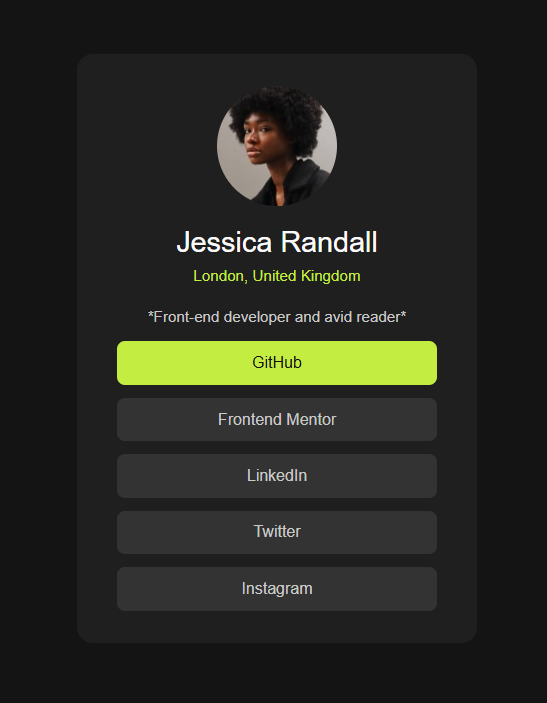

# Frontend Mentor - Social Links Profile Solution

Este é um projeto desenvolvido como parte do desafio ["Social Links Profile"](https://www.frontendmentor.io/challenges/social-links-profile-UG32l9m6dQ) do site Frontend Mentor.  
O objetivo foi criar uma página de links sociais responsiva, acessível e com estilo agradável utilizando apenas HTML e CSS.

---

## 📸 Captura de tela

---

## 🔗 Links

- **Repositório GitHub:** [https://github.com/LilianeBatista/Perfil-de-links-sociais](https://github.com/LilianeBatista/Perfil-de-links-sociais)
- **Site ao vivo:** [https://lilianebatista.github.io/Perfil-de-links-sociais/]

---

## 🧠 O que eu aprendi

Durante este projeto, aprendi a:

- Usar **HTML semântico** para estruturar corretamente a página.
- Aplicar boas práticas de **acessibilidade**, como uso adequado da tag `main` e navegação por teclado.
- Criar e estilizar elementos com **:hover** e **:focus**, destacando estados interativos.
- Trabalhar com **cores, fontes e espaçamentos** no CSS para melhorar a aparência.

---

## ⚙️ Tecnologias utilizadas

- HTML5
- CSS3

---

## 📝 Próximos passos

Pretendo reformular este projeto no futuro, usando-o como base para criar meu **próprio perfil de links sociais personalizado** com identidade visual própria.

---

## 👩‍💻 Autora

- Liliane Batista – Desenvolvedora Front-end
- Localização: Paraná, Brasil  
- Frontend Mentor: [@LilianeBatista](https://www.frontendmentor.io/profile/LilianeBatista)

---

## 🙏 Agradecimentos

Agradeço ao Frontend Mentor por oferecer desafios práticos que me ajudam a evoluir como desenvolvedora.
